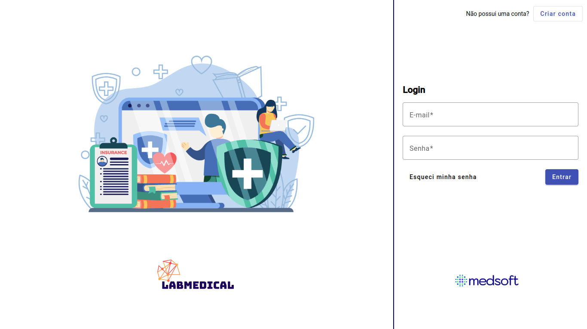

# LABMedical - LABMedicine LTDA




> Tela de Login do Sistema.

### Descrição do Projeto

A LABMedicine LTDA, empresa líder no segmento tecnológico de gestão hospitalar, foi selecionada em edital e recebeu um aporte financeiro para aprimorar seu principal produto, o LABMedical. A expectativa é desenvolver um novo sistema no formato white-label, capaz de ser personalizado e comercializado para hospitais, clínicas particulares e postos de saúde em todo o país.

O modelo white-label consiste em um software padrão que pode ser personalizado com as cores, tipografias, logotipos e demais elementos visuais da identidade do cliente, proporcionando um resultado personalizado.

O perfil de sua squad chamou a atenção dos gestores da empresa, e vocês foram designados para criar o novo produto, utilizando as tecnologias HTML, CSS, JavaScript, Angular, Java, Oracle SQL e Spring. Para a elaboração do projeto, será necessário selecionar uma estrutura padrão de layout e um nome e identidade visual fictícios para o hospital, a fim de ilustrar o uso do software durante a apresentação aos gestores.


## 💻 Pré-requisitos

Antes de começar, verifique se você atende aos seguintes requisitos:

<!---Estes são apenas requisitos de exemplo. Adicionar, duplicar ou remover conforme necessário--->

- Você possui a versão mais recente do `Angular 16.1.0` instalado.

### Configuração da API REST

```
# Iniciando o servidor
Certifique-se de que tenha o Oracle instalado em sua máquina.
Certifique-se que o Oracle esteja em executação na sua máquina.
Executar a API REST desenvolvida em Java e Spring.
Lembrando que por padrão a API vai funcionar no endereço: http://localhost:8081.

```


### Inicialização do Aplicativo

```
# Baixando o projeto
Após clonar o projeto execute o comando: npm install.
Caso encontre alguma vulnerabilidade execute o comando: npm audit fix.

# Executando o projeto
Inicializar o projeto com ng serve --o.
Lembrando que por padrão o projeto vai funcionar no endereço: http://localhost:4200.
```